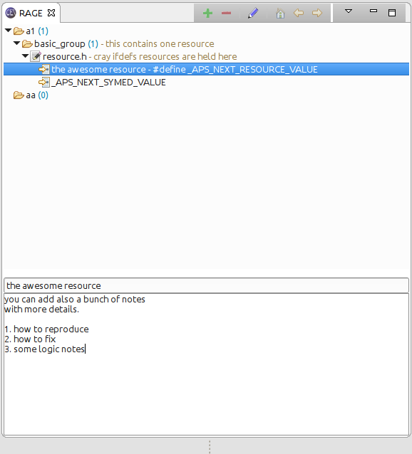

= Resource Analysis and Grouping for Eclipse

A simple plugin that allows creating bookmarks and notes, based on the topic
you want fixed. Simply add the plugin into your `eclipse/plugins` folder, then
open the view using the Eclipse menu: `Window > Show View > Other`, and pick
`RAGE` from the list.

You can create groups, that are just logical structures for you, such as bug
ids, functionality, etc. In these groups you can drag and drop file resources
from the project explorer. In these references you can create bookmarks in the
resource file using the toolbar icons (the plus minus things). The file
location is either the line number, or some text that the line is containing.

The same resource since it's just a bookmark can be present multiple times in
RAGE, in different places.

== Install

Download from:
link:http://get.germaniumhq.com/rage/com.germaniumhq.magicgroup_1.5.0.jar[here],
put in the `plugins` folder of your eclpse, restart eclipse, and select it from
`Window > Show View > Other`.
